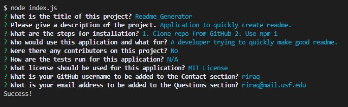
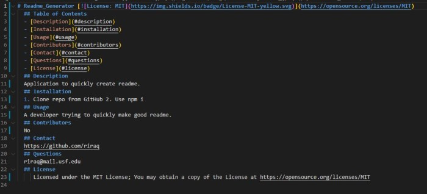
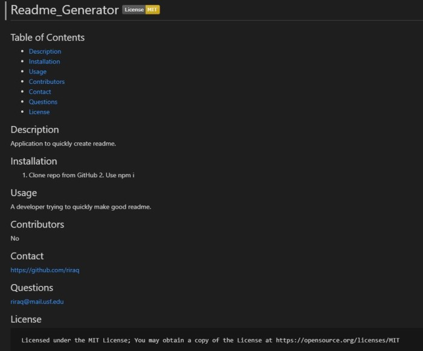

# Readme_Generator
## Code Description
Node.js based app that generates a readme using several prompts for user input. The inputs are done using the Inquirer package through the command line.
## Installation
1. Clone the repository from https://github.com/riraq/Readme_Generator.
2. Run "npm i" in the main directory of the application in order to install dependencies (Inquirer).
## Function
The application functions by running index.js in the command line. This brings up several prompts for the user to answer, with all of them being free text inputs besides the License prompt which allows the user to select one of several options. Once the prompts have been responded to, a "generatedReadme.md" file is created in the same location as the index.js. From there, the file can be edited and used as needed.
## Live Link
https://riraq.github.io/Readme_Generator/
## Video Demo
Direct Link - https://drive.google.com/file/d/1My_XNLbdhmWDgtFDKkgzVvJUgSGGD0Uo/view  
  
## Screenshots
### User Input 

### Raw ReadMe

### ReadMe

